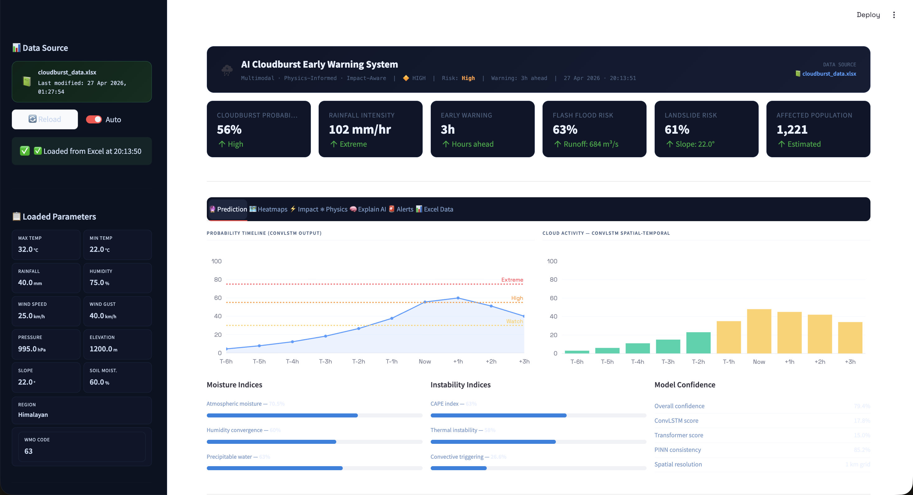
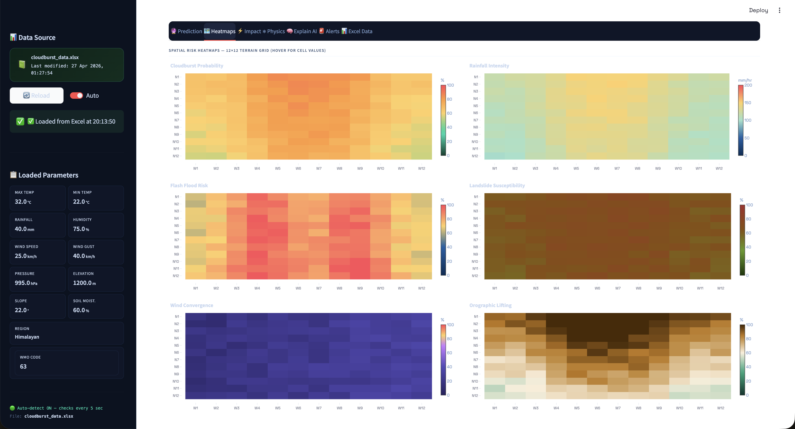
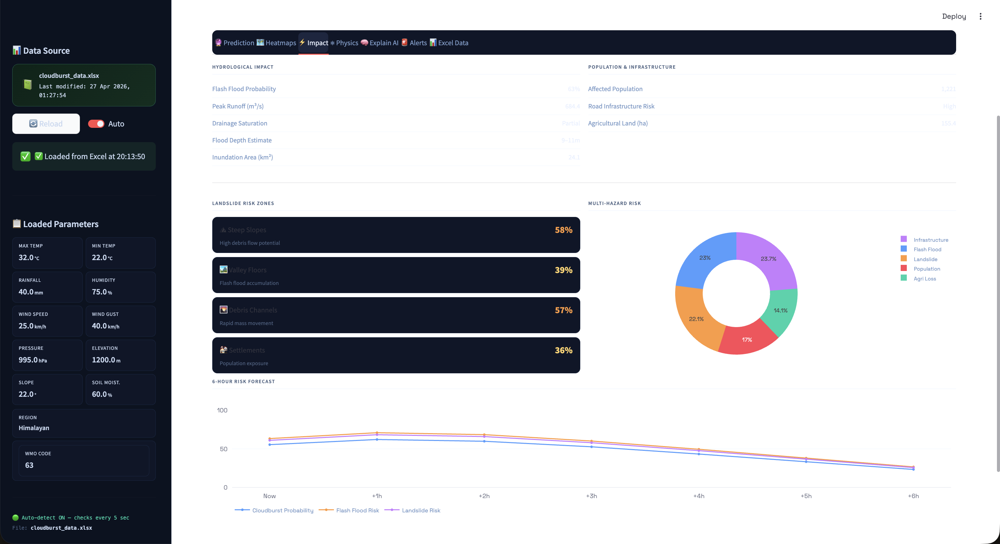
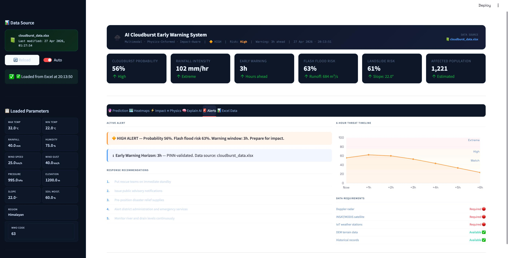
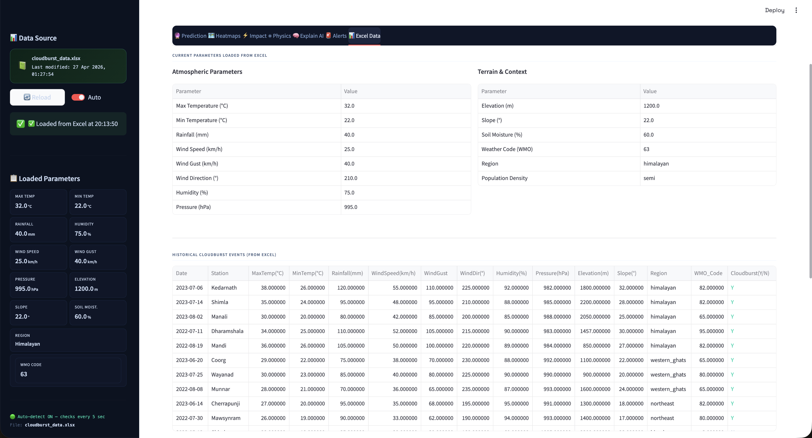

# ⛈ AI Cloudburst Early Warning System

**Physics-Informed Spatio-Temporal Deep Learning for Cloudburst Prediction and Impact Assessment in the Indian Himalayas**

> B.Tech Major Project — SRM Institute of Science and Technology, May 2026  
> Authors: Aaditya Goshike & Maddili Benarjee  
> Guide: Dr. Gowtham P
> In collaboration with: **CSIR-Fourth Paradigm Institute (CSIR-4PI), Bengaluru**

---

## What it does

Predicts cloudbursts 1–3 hours in advance using a hybrid AI + physics approach, and assesses secondary impacts like flash floods, landslides, and runoff. Built for the Indian Himalayan region.

**Core pipeline:**  
Multi-modal data → ConvLSTM + Transformer + PINN → Ensemble prediction → Impact assessment → Streamlit dashboard

---

## Key Features

- Cloudburst probability with early warning (1–3 hour lead time)
- Flash flood, landslide, and runoff risk estimation
- Spatial risk heatmaps (12×12 grid)
- Physics-informed constraints (moisture conservation, orographic lifting, CAPE)
- Explainable AI outputs with feature importance
- Excel-driven input — no coding needed to change inputs
- Auto-detects file changes every 30 seconds

---

## Performance

| Metric | Value |
|--------|-------|
| Accuracy | 85% |
| Precision | 92.8% |
| Recall | 86.7% |
| F1-Score | 89.6% |
| ROC-AUC | 0.913 |
| PR-AUC | 0.941 |

---

## Screenshots

### Dashboard


### Heatmaps


### Impact Analysis


### Physics Indicators


### Explainable AI


### Alerts


### Excel Data


---

## Quick Start

```bash
# 1. Clone the repo
git clone https://github.com/YOUR_USERNAME/cloudburst-early-warning.git
cd cloudburst-early-warning

# 2. Install dependencies
pip install -r requirements.txt

# 3. Run
streamlit run app.py
```

Opens at **http://localhost:8501**

---

## How the Excel Integration Works

```
data/cloudburst_data.xlsx  ←→  app.py
       │                            │
       │  Edit Weather_Input sheet   │  Reads on load / auto-detects changes
       │  (blue cells = inputs)      │  Runs ML + Physics engine
       │                             │  Writes results to Prediction_Log sheet
       └─────────────────────────────┘
```

### Steps
1. Open `data/cloudburst_data.xlsx`
2. Go to **Weather_Input** sheet → edit the blue cells
3. Save the file (`Ctrl+S` / `Cmd+S`)
4. In Streamlit: click **🔄 Reload** or wait ~30 sec for auto-detect
5. All 7 tabs update — Prediction, Heatmaps, Impact, Physics, XAI, Alerts, Excel Data

---

## Project Structure

```
cloudburst-early-warning/
├── app.py                      ← Streamlit app (run this)
├── requirements.txt
├── data/
│   └── cloudburst_data.xlsx    ← Input/output data file
└── backend/
    ├── __init__.py
    ├── prediction_engine.py    ← ML + Physics engine
    └── excel_loader.py         ← Excel read/write module
```

---

## Tech Stack

- **ML/DL:** ConvLSTM, Transformer, Attention Mechanism, PINN
- **Physics:** Moisture conservation, orographic lifting, CAPE, instability index
- **Frontend:** Streamlit, Plotly
- **Data:** NumPy, Pandas, openpyxl
- **Deployment:** Streamlit (local / cloud)

---

## Publication

Paper submitted and abstract accepted at conference (2026).  
Title: *Physics-Informed Spatio-Temporal Deep Learning for Cloudburst Prediction and Impact Assessment in the Indian Himalayas*
